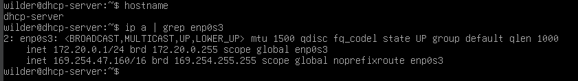
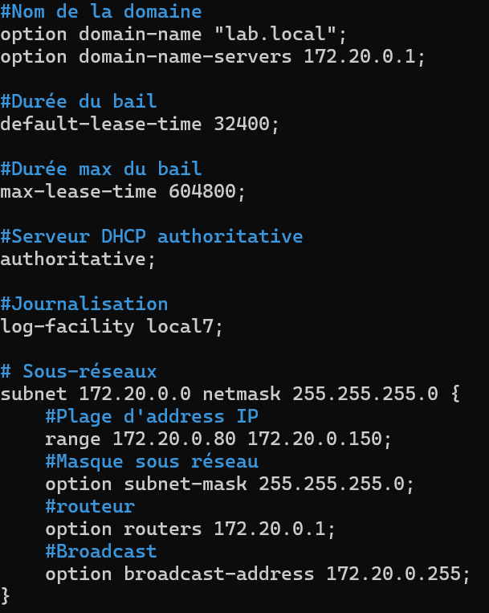
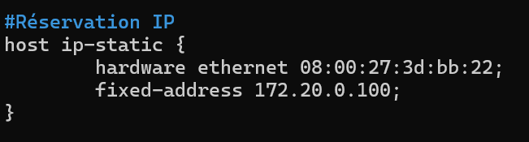
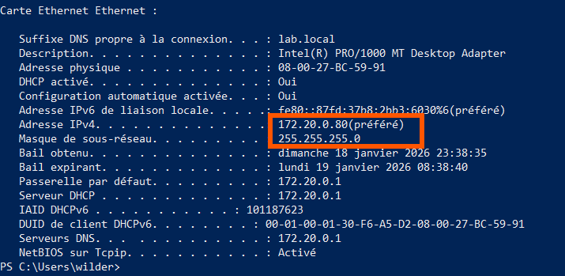
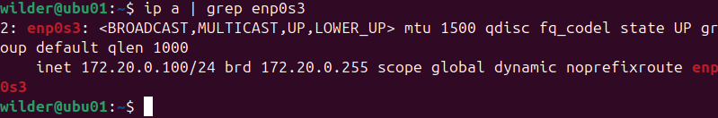

## Quête DHCP avec Debian

#### 1 Configuration le nom de la machine debian-dhcp et son adresse ip static. 

  

---  

#### 2 Configuration de la plage d'adresse IP pour le DHCP sur Debian,    
  

---  

### 3 Configuration l'adresse réservé pour le client 2.

---

#### 4 photo de la configuration IP du Client 1 Windows10.   
  

---  

#### 5 phto de la configuration IP du Client 2 (Ubuntu) qui utilise l'adresse IP réservé sur le Serveur Debian.   
  
